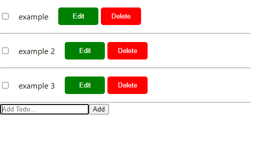

# Simple todo app 

This is a solution to a challenge proposed to me by my mentor Frank Davies, to produce a working todo application.

## Table of contents

- [Overview](#overview)
  - [The challenge](#the-challenge)
  - [Screenshot](#screenshot)
  - [Links](#links)
- [My process](#my-process)
  - [Built with](#built-with)
  - [What I learned](#what-i-learned)
  - [Continued development](#continued-development)
- [Author](#author)
- [Acknowledgments](#acknowledgments)

## Overview

### The challenge

Users should be able to:

- Add, edit, and delete todo elements. 
- Check and uncheck the individual todo elements off as completed.
- See hover states for individual todo elements.

### Screenshot

### Links

- Solution URL: [https://todo-app.cecilmahumane.com](https://todo-app.cecilmahumane.com)

## My process

### Built with

- HTML5
- CSS
- Flexbox
- [React](https://reactjs.org/) - JS library

### What I learned

The purpose of this project was to exercise my skills in using React class based components to build projects. As an afterthought Redux was beginning to be implemented in the project, until I realized using Redux hooks in a class based project would up the complexity of the project, thus the Redux implementation was abandoned. 

### Continued development

In a future todo app using functional components I would like to instate Redux for the management of state in the app. I would also like to strikeout the text upon completion of the item(marking the checkbox). I would also like to have the edit and delete buttons right justified. In a future project I would also like to create a simple server to allow the added todos and deletions to persist.

## Author

- Website - [Cecil Mahumane](https://home.cecilmahumane.com)

## Acknowledgments

I would like to thank Frank Davies for suggesting and providing code reviews for this project.